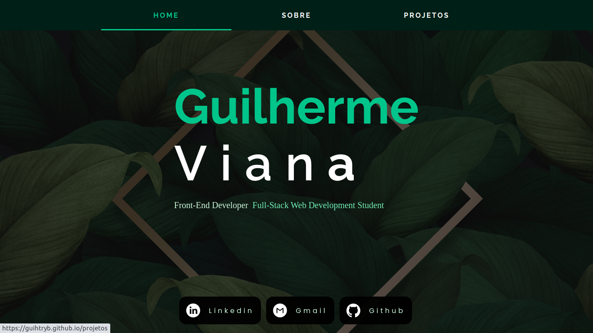
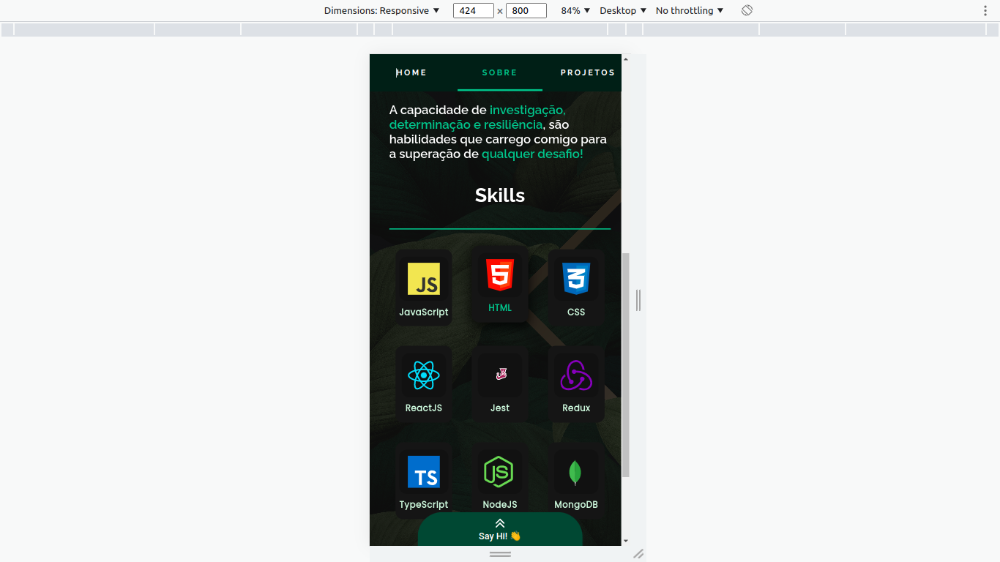
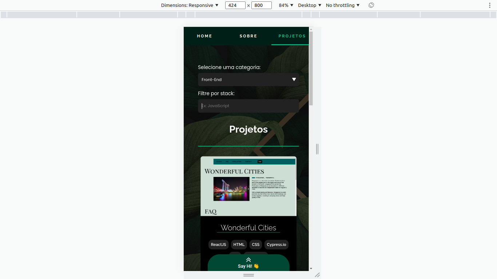
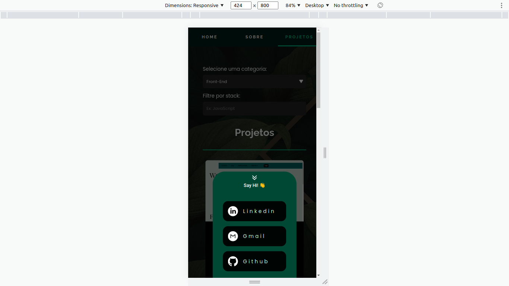
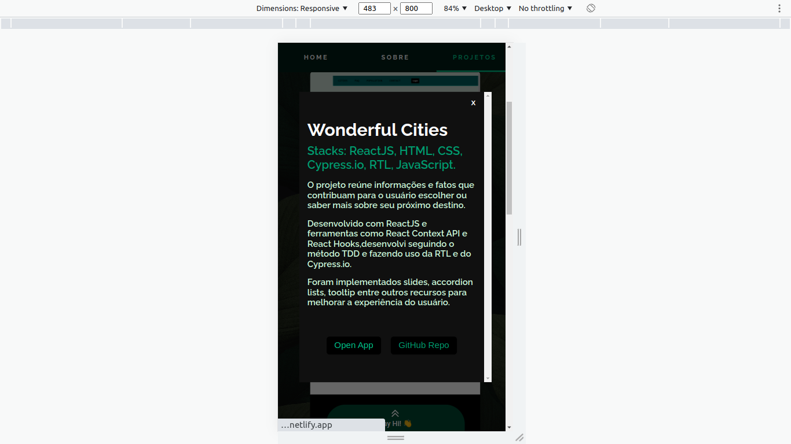
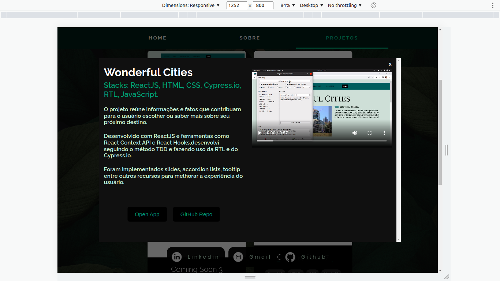

Hello everyone, Be welcome to my portfolio, I hope you like it!

I created this portfolio to tell you more about myself, my goals as a developer, and to show my experiences and projects that I'm developing during this journey!

The entire project was developed with ReactJS and stylized with CSS.

The project has the following pages:

<ul>
  <li>Home Page</li>
  <li>About Page</li>
  <li>Projects Page</li>
  <li>Not Found Page</li>
</ul>

### Home Page

Like all the others, I put a contact list on this page at the bottom. I also have put links below my name. This links will redirect you straight to the Projects page, filtering the projects with the role you've clicked (Front-End or Full-Stack)

  

### About Page

The About page contains information about me, like my skills, some of my goals, and my story.
At the end of the page, you will find a section with some of my skills, when clicking on a skill, you will also be redirected to the Projects page, applying the skill to the filter!

  

### Projects Page

The Project page has, of course, my projects! In This page, you will find projects that I developed, and you can filter by role (Front-End, Back-End, Full-Stack) or technology!
Currently, I'm putting and deploying a lot of projects that I have already developed, so you might find some cards with a "coming soon" image.

  

### Not Found Page

This page has a simple message and a bottom to redirect you to the home page.

  

I developed this portfolio following the "mobile first" method, so it's available and thought to all screen sizes.

  
  
</kbd>